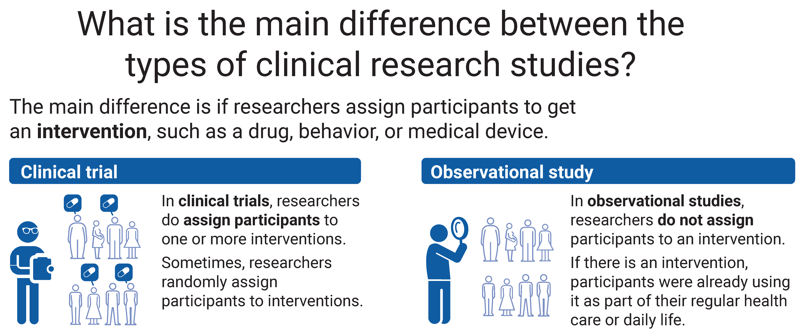

# This page will help you understand clinical research, in general.

Choosing to participate in a study is an important personal decision. If you are considering joining a study, get answers to your questions and know your options before you decide. The NIH Clinical Research Trials and You website is a resource for people who want to learn more about clinical trials. It includes a list of what questions to ask if offered a clinical trial and can help you get information from the research staff to decide if you will join a study. You may also want to talk with your doctor and family or friends about deciding to join a study.

To learn how to search for clinical studies, find studies that are looking for participants, or find the total number of studies on ClinicalTrials.gov, see this series of short videos on the ClinicalTrials.gov Demonstration Videos page.

## What is clinical research and why is it done?
Clinical research is medical research that studies people to understand health and disease. Clinical research helps improve the way doctors treat and prevent illness. Through clinical research, researchers learn:

- How the body works
- How illness develops in people, such as how diseases get better or worse over time
- How the body handles a possible treatment
- Which behaviors help people stay healthy and prevent illness, and which behaviors raise the chance of illness

The goal is to use science to improve people’s health care and health over time. The participants who join and take part in clinical research studies may or may not get any benefit for themselves.

## What are the types of clinical research?
There are 2 main types of clinical research:

- **Clinical trials**, also called interventional studies
- **Observational studies**

Both may try to learn more about an intervention, which may be a drug, behavior, or medical device. The main difference is clinical trial participants are assigned to get an intervention, but observational study participants are not assigned to get an intervention.

### Clinical trials
Clinical trials are research studies in which researchers assign participants to get one or more interventions to test what happens in people. Because of this, clinical trials are also called interventional studies. Often, the intervention is investigational, which means it is not approved for doctors to prescribe to people.

In some clinical trials, researchers assign participants to interventions randomly. This means that researchers assign the participants by chance. Usually, participants (or their doctors) don't choose what intervention they will get when they join a clinical trial.

### Observational studies
Observational studies are research studies in which researchers simply collect information (called data) from participants or look at data that was already collected. The data may be about participants’ health, habits, or environments. In observational studies, researchers do not assign participants to get an intervention. If there is an intervention, participants were already using it as part of their regular health care or daily life.

Often, researchers use observational studies to look at (observe) the different ways people behave and how it affects their health. Some observational studies use patient registries. A patient registry is an organized collection of data that patients agree to give. Researchers can use a patient registry to quickly access data provided by hundreds, or thousands, of similar patients.

### Compare the 2 types of clinical research
The image below compares clinical trials and observational studies:

## Who can join clinical research?
Researchers look for people who fit a certain description, called eligibility criteria. These criteria give details on who can and cannot join a study and could include:

- People of a certain age or sex
- People who do or do not have a certain illness, disease, or health condition
- People with or without a certain health history, such as a prior treatment
- People who are exposed to or are in contact with something that affects their health

Researchers use eligibility criteria to keep participants safe and enroll the right participants to collect the data they need to answer the research question. There are many kinds of research studies, all with different types of eligibility criteria.

## Why do people join clinical research?
Participants may or may not get any benefit themselves from joining a clinical research study. In clinical trials, researchers often don’t know if the intervention will be helpful, harmful, or the same as regular health care.

Some people volunteer to join clinical research to:

- Help researchers learn about health, illness, or treatments
- Be a part of discovering health information that may help others in the future
- Possibly get a drug or medical device that is not yet approved to be used in people with a certain health condition

## What about safety and chance of harm (risk) during clinical research?
All studies involve some level of risk or harm to participants. Because of this, there are people and systems in place to look out for participants’ safety.

The possible risks of taking part in clinical research include:

- The chance that participants will have a side effect or other health problem during a study (also called an adverse event)
= Participants may not get the intervention being tested in a clinical trial – instead, they may get the standard treatment or no treatment at all
- The intervention being tested may not work or may not work better than the standard treatment
- The study may require more time and visits than their regular health care.

All clinical research involves some risk. Different kinds of studies have different amounts of risk to participants. For example, the amount of risk may be the same or different as participants’ regular health care.

## How do researchers manage risk during clinical research?
In most clinical research studies, researchers use a group of experts, called an ethics review committee or Institutional Review Board (IRB), to make sure the amount of risk to participants is acceptable and as low as possible. They compare the study risks to the study benefits that participants or others in the future may receive to improve their health. For example, the IRB may decide that a clinical trial with a higher risk can proceed because the trial is testing a new drug that could help people who have no other treatment options.

Some studies that take place in the U.S. or are funded by the U.S. government must follow rules set by other U.S. agencies to help manage risk. These agencies include the Office for Human Research Protections (OHRP) and the Food and Drug Administration (FDA). Other countries may have their own rules, agencies, or offices to help manage risk.

Many clinical trials for new drugs or medical devices move in a series of steps (called phases) to keep risk to participants as low as possible and answer different research questions. Each phase is designed to test the drug or device in as few participants as possible to answer the research question. Some clinical trials are considered more than one phase.

## What happens during clinical research?
Before clinical research begins
Clinical research relies on people who join. People who are thinking about joining a study get information about the study to help them decide. Research staff are available to answer their questions. This process is called informed consent. It’s the main way people get study information before deciding whether or not to join a study.

Informed consent is a process that includes a document that has important information about taking part in the study, including:

- A description of what will happen during the study
- Who can join the study
- How much of participants’ time the study will take
- Any payments and costs, such as payment participants get from taking part and any costs participants may need to pay
- The known benefits and risks of taking part in the study

Other ways people can get information about a study may include:
- Asking the research study staff questions
- Reading brochures or websites
- Watching videos about the study

If someone has discussed the study with the research staff, has had their questions answered, and agrees to join the study, they sign the informed consent form. Even if they sign the informed consent, they can leave the study at any time and for any reason. If they decide to leave, they can talk to the research staff to do so safely.

## During clinical research
Clinical research happens in many ways, depending on the type of study. Studies can take place at hospitals, clinics, research centers, universities, over the phone, or on the internet. They may take a few days, weeks, or even years.

Researchers may assign participants into different groups. This happens in studies that compare an intervention to something else. For example, researchers may:

- Compare 2 drugs to see which works better or has fewer unwanted side effects
- Compare a drug to a placebo (a substance or treatment that looks like the drug, and is given in the same way, but has no active drug)
- Compare getting a treatment to no treatment

Often in clinical trials, researchers assign participants into the groups at random (by chance). These participants may not know what group (or intervention) they have been assigned, and the staff may not know either. This is called "masking" or "blinding". This ensures that participants and research staff do not know what intervention each participant receives to help make sure the results are looked at fairly.

In other types of clinical trials, all the participants get the intervention being studied.

## How does joining a study affect participants’ usual health care?
In most studies, participants can keep seeing their regular doctors. If needed, the research staff will work with participants’ doctors to make sure that being in the study will not cause problems. In some studies, participants may have to change or limit their usual health care, such as stopping other medicines they take.

## What if participants have health problems during clinical research?
Research staff will explain what to do if participants have health problems during the study. Usually, research staff ask participants to report health problems to them right away. Research staff include doctors and nurses who will work with participants and the participants’ regular doctors to address the problem.

A group of experts may also oversee what is happening in the study. If they have a safety concern, they contact the researchers right away.

If very serious health problems happen to participants during the study, the researchers may stop the study.

Participants can choose to leave the study, called "withdrawal", at any time and for any reason. If they decide to leave, they can talk to the research staff to do so safely.

## How do researchers collect data?
During the study, researchers collect data from participants to help answer their research question. They do this in different ways, such as:

- Surveys or questionnaires
- Getting images, such as X-rays or MRIs
- Taking measurements, such as height, weight, or blood pressure
- Taking samples of participants’ blood or tissue to look at in a lab

Researchers may need to collect data from participants many times or only a few times.

## How do researchers use the data they collect?
Researchers analyze (study) the data they collect from participants based on the research plan to answer their research questions. Different countries have different rules about how researchers can use each type of data. The informed consent form describes what researchers plan to do with participants’ data.

## After clinical research, how do researchers share what they learned?
After the researchers analyze the data and the study is complete, researchers can share the study results. Study results summarize group data collected from all participants. These results can be published in research journals, on the internet, and on ClinicalTrials.gov. In some cases, researchers may list data from individual participants, but not in a way that allows readers to identify the participant.

If the researchers tested a new drug or treatment that they want to make available to all patients, they submit the data and results from clinical trials to the FDA. Experts at the FDA will look at the data from the clinical trials and decide whether to approve the treatment for use in people with a certain condition.

Usually, researchers need many studies before changing the way doctors prevent and treat illnesses.

## Who carries out clinical research?
The sponsor oversees a study and may be:

- An organization, such as a medical center or drug maker
- An individual, such as a doctor

The sponsor may have another organization carry out the study on their behalf. The person leading a research study is called the principal investigator (PI). The PI is usually a medical doctor or another type of scientist. The PI typically works for the sponsor and leads a team of research staff that could include doctors, nurses, researchers, and technicians. The team of research staff may work at sites around the U.S. and other countries to carry out the research.

## Who pays for clinical research?
The funder is the organization that pays the costs of carrying out a study. The funder can be:

- The U.S. government, or governments of other countries
- Drug makers or other private companies (industry)
- Medical centers
- Universities

## Charities or non-profit organizations

Do participants have to pay any costs or do they get paid for taking part in clinical research?
The informed consent form describes the study’s payment and costs. Some studies pay participants who take part, but the amount varies based on the study.

Many clinical studies pay for the cost of the intervention and any research-related tests and visits. Some studies may pay costs for research-related travel and lodging, such as costs for parking or meals. Participants, or their insurance companies, still have to pay the cost of their regular health care.

## What is expanded access?
Expanded access is a possible way for a patient with a serious illness who is unable to take part in a clinical trial to get an intervention (such as a drug or medical device) that isn’t yet approved for treatment. Expanded access is not clinical research and is not available for all interventions being tested.

For patients who cannot join a clinical trial and have no other treatment options, expanded access may be an option.

The U.S. FDA regulates expanded access. Read more about expanded access on the FDA’s website.

Last updated on June 10, 2024